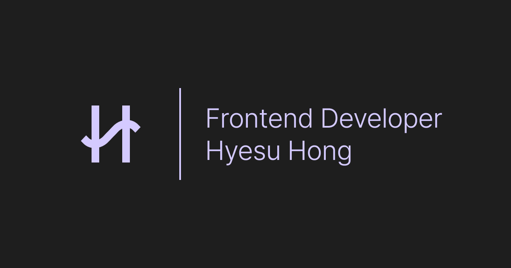

# Portfolio (updated 2023)

  

`React`와 `Typescript`로 제작한 포트폴리오 홈페이지입니다.

**[👉 홈페이지 바로가기](https://portfolio-hyesuhong.vercel.app/)**

## 💡 기능

- 반응형 웹
- 스크롤 네비게이션
- 라이트/다크 모드 지원

### 반응형

| PC | Mobile |
|--|--|
|||

### 스크롤 네비게이션

헤더에 현재 화면에 보이는 위치를 표시하기 위해, Intersection Observer API를 사용해 스크롤시 해당 섹션의 이름에 표시가 되도록 구현했습니다. 헤더의 섹션명을 클릭시 해당 섹션으로 스크롤됩니다.

### 라이트/다크 모드

| Light | Dark |
|--|--|
|||

화면의 왼쪽 하단에 위치한 아이콘을 누를 시 테마가 변경되도록 구현했습니다.

## 🛠️ 기술 스택

